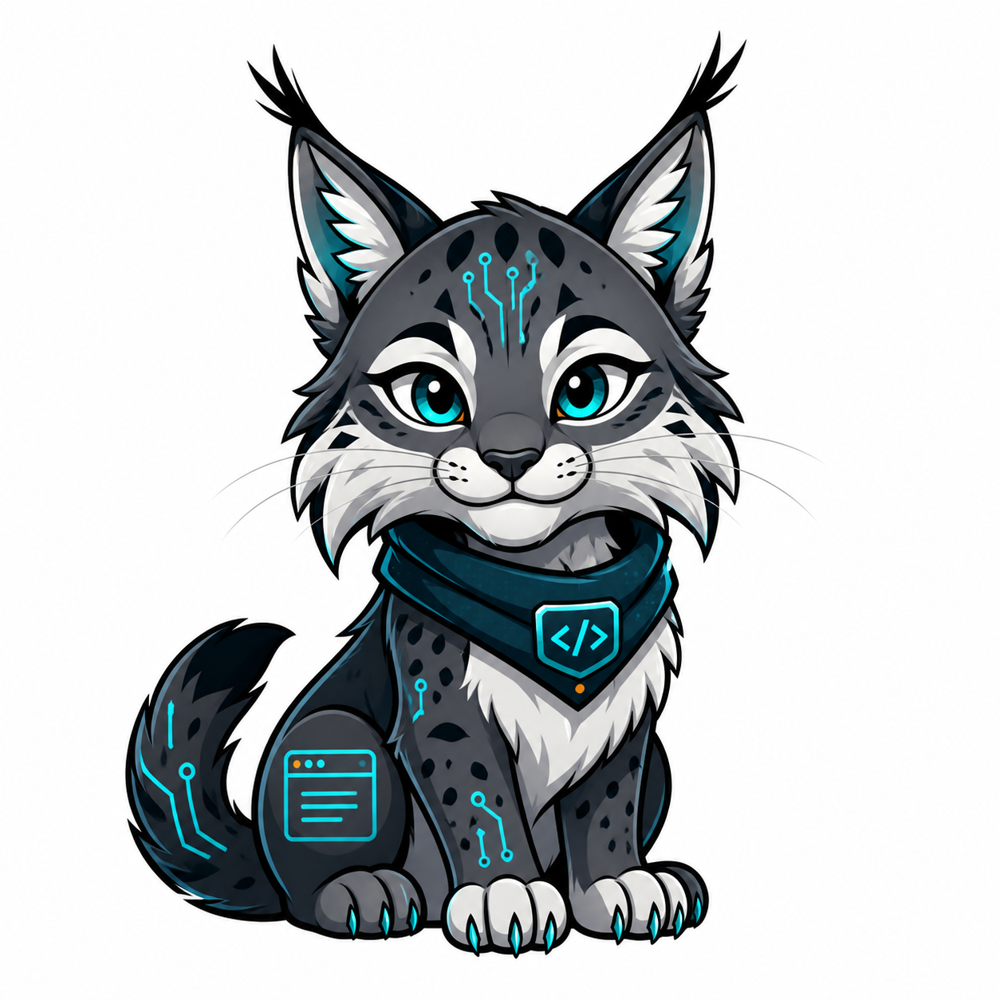

# RenderClaw

Open source AI-assisted prerendering for crawler-ready websites.

<p align="center">
  
</p>

RenderClaw is a self-hosted rendering gateway that turns crawler requests into fast, optimized, fully rendered HTML snapshots. It is built for developers, SEO engineers, agencies, and teams that need modern JavaScript-heavy or poorly optimized websites to be readable by search engines and social preview crawlers.

Human visitors are redirected to the original website. Crawlers receive a rendered, cacheable, crawler-specific HTML version of the same page.

> RenderClaw is not a cloaking tool. Crawler-facing output should represent the real content of the source page.

## Mascot

Meet **Nexa**, the RenderClaw cyber lynx.

Nexa represents the project's core traits: sharp crawler instincts, fast rendering, careful protection of source content, and clean developer-friendly intelligence. The lynx was chosen for its agility, precision, and watchful nature.

## Features

- Crawler detection for Googlebot, Bingbot, social preview bots, validators, and generic bots.
- Real browser rendering with Puppeteer.
- Crawler-specific HTML cache variants.
- Stale-while-refresh behavior for fast crawler responses.
- In-memory rate limiting and render queue caps for safer public deployments.
- Request IDs on every response for easier debugging.
- SQLite storage for analyzed sites, pages, links, render events, cache variants, and AI analyses.
- Optional AI SEO optimization with OpenAI.
- Conservative metadata improvements: title, description, canonical, robots, Open Graph, Twitter Cards, and JSON-LD.
- Deterministic SEO scoring for rendered pages, including canonical, robots, headings, images, social metadata, and JSON-LD checks.
- CSS and images remain available to crawlers.
- Heavy media, fonts, and known tracking hosts are blocked during render.
- Render concurrency limits and browser reuse to reduce memory pressure.
- Central config file with environment variable overrides.

## Quick Start

```bash
git clone https://github.com/H4ckd/renderclaw.git
cd renderclaw
npm install
npm start
```

Health check:

```bash
curl http://localhost:5000/health
```

Every response includes an `X-Request-Id` header. You can also provide your own `X-Request-Id` from a reverse proxy or client.

Render a page as Googlebot:

```bash
curl -A "Mozilla/5.0 (compatible; Googlebot/2.1; +http://www.google.com/bot.html)" \
  http://localhost:5000/example.com/
```

Run checks, tests, and the smoke test:

```bash
npm run check
npm test
npm run smoke
npm run audit
```

## How It Works

Request format:

```text
/:domain/:path
```

Example:

```text
http://localhost:5000/example.com/products/item
```

For regular visitors, RenderClaw redirects to:

```text
https://example.com/products/item
```

For crawlers, RenderClaw:

1. identifies the crawler profile;
2. checks the crawler-specific cache;
3. renders the target page if needed;
4. extracts SEO and page signals;
5. optionally asks the AI optimizer for crawler-specific recommendations;
6. injects safe metadata improvements;
7. stores the result in SQLite and filesystem cache;
8. returns optimized HTML.

## Configuration

Main config:

```text
config/renderclaw.config.json
```

Example config:

```text
config/renderclaw.example.json
```

Private local override:

```text
config/renderclaw.local.json
```

The local config file is ignored by Git. Environment variables always take priority over config files.

Useful environment variables are documented in:

```text
.env.example
```

## AI Optimization

RenderClaw can use OpenAI to generate crawler-specific SEO recommendations.

```bash
OPENAI_API_KEY=your_key_here
AI_ENABLED=true
OPENAI_MODEL=gpt-4.1-mini
AI_TIMEOUT_MS=4500
```

If no API key is provided, RenderClaw continues to work using a deterministic fallback optimizer.

The AI layer is intentionally conservative. It should improve crawler metadata based on the rendered page, not invent new page content.

## Production Safety

Before exposing RenderClaw publicly:

- Set `ALLOWED_DOMAINS`.
- Set `ADMIN_TOKEN` to protect `/admin/*`.
- Keep `/admin/*` behind a VPN or private network when possible.
- Use a reverse proxy with rate limiting.
- Tune `RATE_LIMIT_*` and `MAX_QUEUE_SIZE` for your deployment size.
- Keep `OPENAI_API_KEY` out of Git.
- Monitor memory, browser health, render queue depth, and cache size.
- Do not use RenderClaw to serve misleading crawler-only content.

## Runtime Data

RenderClaw writes runtime data under:

```text
data/
```

This includes:

- `data/renderclaw.sqlite`
- cached HTML files;
- runtime logs.

The `data/` directory is ignored by Git.

## Endpoints

```text
GET /health
GET /metrics
GET /admin/sites
GET /admin/sites/:domain/discovery
POST /admin/sites/:domain/discovery
GET /admin/sites/:domain/report
GET /admin/sites/:domain/urls
POST /admin/sites/:domain/crawl/queue
POST /admin/sites/:domain/crawl/render
GET /admin/pages
GET /admin/pages/:id/report
GET /:domain/*?
```

Metrics and admin endpoints require:

```text
Authorization: Bearer <ADMIN_TOKEN>
```

If `ADMIN_TOKEN` is not set in development, these endpoints remain open for local testing. In production, RenderClaw refuses to start without both `ADMIN_TOKEN` and `ALLOWED_DOMAINS`.

## Project Structure

```text
app.js                    Application entrypoint
config/                   RenderClaw configuration
src/server.js             Server composition
src/config.js             Config loader and environment overrides
src/http/                 Routes, crawler detection, headers
src/rendering/            Browser, queue, rendering, SEO optimization
src/storage/              SQLite and HTML cache
src/ai/                   AI SEO analysis client
src/bootstrap/            Runtime filesystem setup
```

## Roadmap

- Domain allowlist enforcement mode.
- Admin authentication.
- Rate limiting.
- Docker image.
- Web dashboard.
- Sitemap discovery.
- SEO scoring.
- Robots.txt analysis.
- JSON-LD generators.
- Redis/Postgres adapters.
- Distributed render workers.
- Plugin system for crawler profiles.

## Contributing

Contributions are welcome. Read [CONTRIBUTING.md](CONTRIBUTING.md) before opening a pull request.

Good first areas:

- crawler profile improvements;
- deployment docs;
- tests;
- Docker support;
- admin authentication;
- rate limiting.

## Security

Please read [SECURITY.md](SECURITY.md). Do not open public issues for sensitive vulnerabilities.

## License

RenderClaw is released under the [MIT License](LICENSE).
